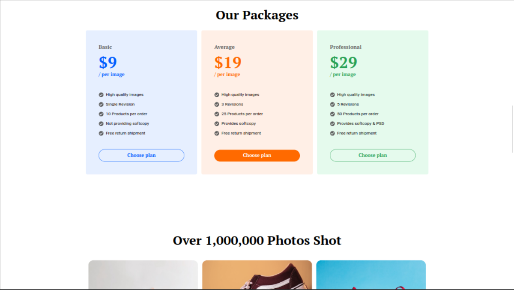

# ClickR Photography

A landing page in ReactJs and TailwindCSS based on a design found in Figma Community for a fake online photography
business called ClickR

## Links

    
    

## Screenshots

### First Section

### Steps and Testimonials

### Packages

### Portfolio

### Services

### FAQ

